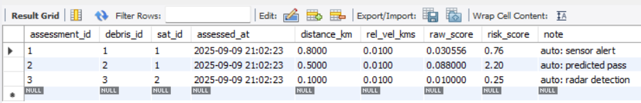

# Orbit Guardian 

SQL-based system to catalog space debris, track close approaches, and auto-generate collision risk scores for satellites.

##  Overview
Space debris poses a significant threat to operational satellites. This project uses SQL (MySQL-compatible) to model debris, satellites, close approaches, and automatically calculate risk scores when potential collisions are detected.

##  Features
- Store debris and satellite information
- Log close approaches (debris ↔ satellite)
- Auto-generate risk assessments via triggers
- Risk scoring considers altitude difference, relative velocity, and debris size
- Easy to run in MySQL Workbench

##  Output
<div align="center">
  
</div>

##  Tech Stack
- **Database:** MySQL
- **Procedures & Triggers:** SQL stored procedures
- **Environment:** MySQL Workbench / Command-line client

##  How to Run
1. Open MySQL Workbench (or CLI).
2. Copy contents of `space_debris_mysql.sql` into a new SQL tab.
3. Run the script (creates database, tables, trigger, and inserts sample data).
4. Query results:
   ```sql
   SELECT * FROM risk_assessments;
   ```
